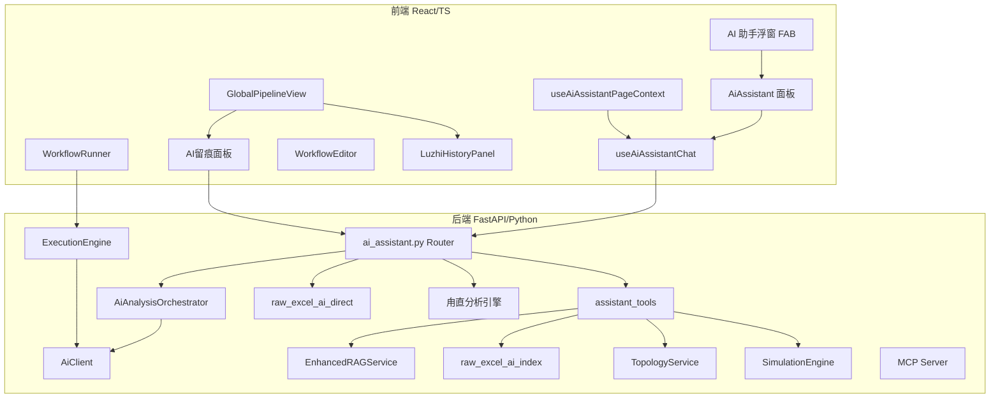
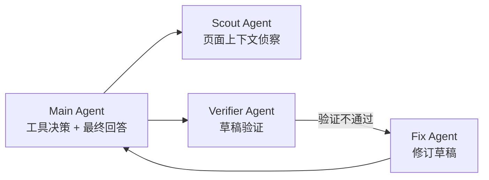
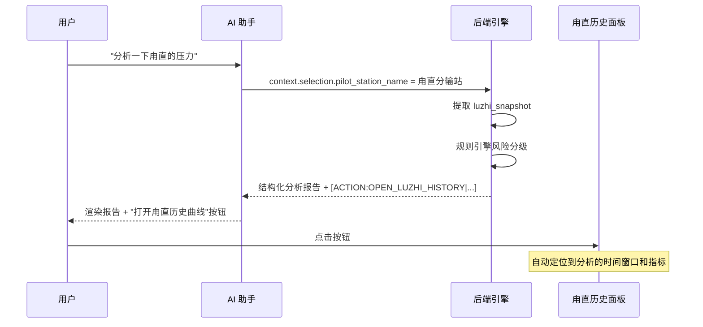
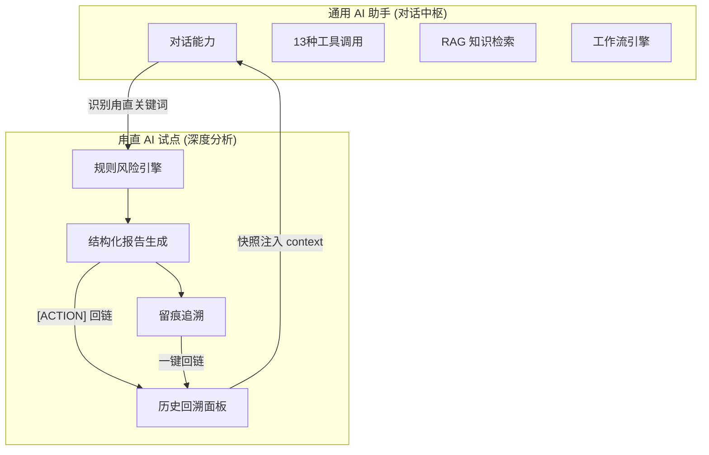

# SmartGas-Grid AI 智能分析功能全景分析

## 总体架构概览

SmartGas-Grid（智脉平台）的 AI 智能分析体系由 **两大模块** 构成：

| 模块 | 定位 | 核心能力 | 数据来源 |
| --- | --- | --- | --- |
| **通用 AI 助手** | 全平台对话式智能中枢 | 工具调用、知识检索、断流推演、趋势预测 | 数据库 + 向量库 + 拓扑图 |
| **甪直 AI 试点** | 单站深度分析试点 | 真实 SCADA 分析、风险分级、留痕追溯 | 甪直站真实 Excel 历史数据 |



---

## 一、通用 AI 助手系统

### 1.1 前端交互层

#### 入口组件：[AiAssistant.tsx](file:///f:/smartgas-grid/src/components/ai-assistant/AiAssistant.tsx)

- **浮动 FAB 按钮**：可拖拽、点击展开/收起 AI 面板
- **可弹出独立窗口**：支持 `popOut` 为独立 `window.open` 窗口，通过 `postMessage` + `BroadcastChannel` 同步状态
- **智能消息渲染**：
  - 自动解析 Markdown 表格渲染为 HTML `<table>`
  - 识别 `[ACTION:OPEN_LUZHI_HISTORY|...]` 指令标记，渲染为可点击操作按钮
  - 显示工具调用状态徽章（如"正在查询站场..."）
  - 显示 RAG 检索日志（检索到的文件列表）

#### 对话引擎：[useAiAssistantChat.ts](file:///f:/smartgas-grid/src/components/ai-assistant/useAiAssistantChat.ts)

- **SSE 流式协议**：使用 `AsyncGenerator` 解析后端 SSE 流
- 支持 4 种消息类型：`[REPLY]`、`[TOOL]`、`[LOG]`、`[ERROR]`
- 实时更新消息内容，支持工具调用状态实时显示

#### 页面上下文：[useAiAssistantPageContext.ts](file:///f:/smartgas-grid/src/components/ai-assistant/useAiAssistantPageContext.ts)

- 根据当前路由自动注入页面上下文（`page`、`module`、`summary`）
- 通过 `runtimeAssistantContext` 捕获运行时上下文（甪直快照、所选节点、趋势管线等）
- 上下文会自动注入到 AI 请求中，使 AI 回答「感知当前页面」

### 1.2 后端处理层

#### 主路由：[ai_assistant.py](file:///f:/smartgas-grid/backend/app/routers/ai_assistant.py)

请求处理的 **5 级优先级链**：

```
1. 快速问候 → 直接返回固定文案
2. raw_excel_direct 精确计数/列表/实体查询 → 秒级离线回答
3. 甪直试点分析 → 命中即走专属引擎分析
4. Orchestrator 编排模式 → Sub-Agent 多角色协作
5. Legacy 模式 → 传统大模型 + 工具调用链
```

#### AI 客户端：[ai_client.py](file:///f:/smartgas-grid/backend/app/services/ai_client.py)

- **双 Provider 支持**：OpenAI 兼容 API + MiniMax 原生 API
- **流式与非流式**双模：`chat_completion()` 与 `chat_stream()`
- **自动重试**：429 限流时自动退避重试
- **动态环境切换**：每次调用 `reload_settings()`，支持运行时热切换 Provider

### 1.3 三大知识库

#### ① AI 索引库（raw_excel_ai_index）

| 文件 | 功能 |
| --- | --- |
| [raw_excel_ai_index.py](file:///f:/smartgas-grid/backend/app/services/raw_excel_ai_index.py) | 从 Excel 原始数据构建内存索引 |
| [raw_excel_ai_direct.py](file:///f:/smartgas-grid/backend/app/services/raw_excel_ai_direct.py) | 离线快速应答（不需要大模型） |

- 直接解析用户自然语言 → 识别意图（计数/列表/实体查询）→ 从索引库秒级返回结果
- 支持范围过滤（如 "西一线有多少分输站"）
- 所有回复自动追加 "完整性提示" 标记

#### ② 规程向量库（ChromaDB + RAG）

| 文件 | 功能 |
| --- | --- |
| [rag_enhanced.py](file:///f:/smartgas-grid/backend/app/services/rag_enhanced.py) | 混合检索引擎 |

- **向量检索**：使用 MiniMax `embo-01` 模型生成 1536 维查询向量
- **降级策略**：API 不可用时降级到 ChromaDB 内置 Embedding
- **混合查询策略**：应急预案关键字匹配 → Text-to-SQL → 向量语义搜索 → Fallback
- 内置 4 类应急预案知识（压力下降/管线断裂/阀门故障/供气不足）

#### ③ 拓扑关系库（NetworkX 图计算）

通过 `TopologyService` 提供图算法能力：

| 能力 | 算法 | 用途 |
| --- | --- | --- |
| 影响分析 | BFS 图遍历 | 管线故障影响范围 |
| 路径搜索 | 最短路径 | 故障后备选路径 |
| 关键节点 | 介数中心性 | 卡脖子站场识别 |
| 断流推演 | 仿真引擎 | 故障后传播过程模拟 |

### 1.4 工具调用系统（13 个工具）

[assistant_tools.py](file:///f:/smartgas-grid/backend/app/services/assistant_tools.py) 定义了 13 种 AI 可调用工具：

| 工具名 | 类别 | 功能描述 |
| --- | --- | --- |
| `query_stations` | 查询 | 按类型/关键字查询站场 |
| `get_station_details` | 查询 | 获取站场详细物理属性 |
| `query_pipelines` | 查询 | 按类别/关键字查询管线 |
| `count_by_type` | 统计 | 站场或管线分类统计 |
| `analyze_impact` | 分析 | 管线故障影响范围 |
| `find_routes` | 分析 | 屏蔽故障后路径搜索 |
| `get_topology_summary` | 分析 | 管网拓扑概览 |
| `find_critical_nodes` | 分析 | 介数中心性关键节点 |
| `simulate_failure` | 推演 | 断流仿真传播过程 |
| `simulate_cutoff` | 推演 | BFS 截断推演 + 管存时长估算 |
| `search_knowledge_base` | 检索 | ChromaDB 向量知识检索 |
| `predict_trend` | 预测 | 线性回归趋势预测 + 超标剩余时间 |
| `analyze_correlation` | 诊断 | 皮尔逊相关系数 + 异常模式检测 |

> [!IMPORTANT]
> 工具调用采用 **JSON 格式触发** — AI 输出 `{"tool": "xxx", "args": {...}}` 格式后，后端解析并执行，再将结果注入回上下文由 AI 总结回答。

### 1.5 Sub-Agent 编排引擎

[ai_analysis_orchestrator.py](file:///f:/smartgas-grid/backend/app/services/ai_analysis_orchestrator.py) 实现了多角色 AI 协作：



- **触发条件**：当请求携带 `context`（页面上下文）或 `analysis_mode=subagents` 时激活
- **Validator**（[analysis_validator.py](file:///f:/smartgas-grid/backend/app/services/analysis_validator.py)）：验证回复的完整性和准确性
- **FixRouter**（[fix_task_router.py](file:///f:/smartgas-grid/backend/app/services/fix_task_router.py)）：自动修订不合格的草稿

### 1.6 工作流执行引擎

| 文件 | 功能 |
| --- | --- |
| [ExecutionEngine](file:///f:/smartgas-grid/backend/app/services/execution_engine.py) | 多步骤工作流顺序执行 |
| [WorkflowRunner.tsx](file:///f:/smartgas-grid/src/components/workflow/WorkflowRunner.tsx) | 前端执行界面 |
| [WorkflowEditor.tsx](file:///f:/smartgas-grid/src/components/workflow/WorkflowEditor.tsx) | 工作流编辑器 |

特点：
- **模板变量系统**：支持 `{{input}}`、`{{prev_output}}`、`{{step_N_output}}`、`{{database_context}}`、`{{rag_context}}`
- **上下文自动注入**：根据输入关键词自动匹配管线数据 + RAG 检索结果
- **SSE 流式进度**：逐步返回 `step_start` → `step_complete` → `complete`

### 1.7 MCP 协议集成

[MCP Server](file:///f:/smartgas-grid/backend/app/mcp) 实现 Model Context Protocol 三大能力：

| 能力 | 文件 | 说明 |
| --- | --- | --- |
| **Tools** | [tools.py](file:///f:/smartgas-grid/backend/app/mcp/tools.py) | 暴露管网查询工具给外部 AI |
| **Resources** | [resources.py](file:///f:/smartgas-grid/backend/app/mcp/resources.py) | 暴露管网数据资源 |
| **Prompts** | [prompts.py](file:///f:/smartgas-grid/backend/app/mcp/prompts.py) | 预定义提示词模板 |

---

## 二、甪直 AI 试点系统

### 2.1 系统定位

甪直试点是 **从通用 AI 助手演化出的实战深度分析系统**，针对甪直分输站这个具体站场，基于 **真实 SCADA 历史数据** 提供：

- 多管线 × 多指标的结构化风险分析
- 全自动风险分级 + 置信度评估
- 分析过程留痕与可追溯
- AI ↔ 历史面板双向联动

### 2.2 数据层

#### 真实数据来源

| 文件 | 说明 |
| --- | --- |
| [parse_luzhi.py](file:///f:/smartgas-grid/scripts/parse_luzhi.py) | 从 Excel（甪直站20262311-0312.xlsx）解析 → JSON |
| [luzhi_history.json](file:///f:/smartgas-grid/src/data/luzhi_history.json) | 解析后的前端可用时序数据 |
| [luzhiHistoryData.ts](file:///f:/smartgas-grid/src/data/luzhiHistoryData.ts) | TypeScript 数据服务层 |

#### 8 项监测指标

| 指标 | 管线 | 类型 | 颜色 |
| --- | --- | --- | --- |
| 西一线进站压力 | 西一线 | pressure | 🔴 #ef4444 |
| 西一线进站温度 | 西一线 | temperature | 🟠 #f97316 |
| 西二线进站压力 | 西二线 | pressure | 🔵 #3b82f6 |
| 西二线进站温度 | 西二线 | temperature | 🔵 #06b6d4 |
| 中俄线进站压力 | 中俄线 | pressure | 🟢 #10b981 |
| 中俄线进站温度 | 中俄线 | temperature | 🟢 #84cc16 |
| 西二线水露点 | 西二线 | dewpoint | 🟣 #a78bfa |
| 中俄线水露点 | 中俄线 | dewpoint | 🟡 #f59e0b |

### 2.3 风险分级引擎

后端 [ai_assistant.py](file:///f:/smartgas-grid/backend/app/routers/ai_assistant.py) 实现了一套 **纯规则驱动** 的多维度风险分级引擎（无需调用大模型）：

#### 压力类阈值

| 风险等级 | 波动幅度 (swing) | 6h变化量 (Δ) | 触发原因 |
| --- | --- | --- | --- |
| 高 | ≥ 0.45 MPa | ≥ 0.22 MPa | 压力波动较大 |
| 中 | ≥ 0.30 MPa | ≥ 0.15 MPa | 压力波动偏大 |
| 低 | ≥ 0.20 MPa | ≥ 0.10 MPa | 压力有轻微波动 |
| 正常 | < 0.20 MPa | < 0.10 MPa | 压力变化在稳态区间 |

#### 温度类阈值

| 风险等级 | 波动幅度 | 6h变化量 | 触发原因 |
| --- | --- | --- | --- |
| 高 | ≥ 8.0°C | ≥ 4.0°C | 温度变化过快 |
| 中 | ≥ 5.0°C | ≥ 2.5°C | 温度波动偏大 |
| 低 | ≥ 3.0°C | ≥ 1.5°C | 温度有可见波动 |
| 正常 | < 3.0°C | < 1.5°C | 温度变化在稳态区间 |

#### 露点类阈值

| 风险等级 | 波动幅度 | 6h变化量 |
| --- | --- | --- |
| 高 | ≥ 6.0°C | ≥ 3.0°C |
| 中 | ≥ 4.0°C | ≥ 2.0°C |
| 低 | ≥ 2.5°C | ≥ 1.2°C |
| 正常 | < 2.5°C | < 1.2°C |

#### 置信度估算

```python
base = 0.72
base += min(swing × 0.08, 0.12)      # 波动越大越可信
base += min(abs_delta × 0.10, 0.10)   # 变化越明显越可信
base += {低: 0.03, 中: 0.06, 高: 0.09}  # 风险越高越可信
base += {pressure: 0.02}               # 压力类加分
→ 范围：[0.60, 0.95]
```

### 2.4 分析报告生成

当 AI 助手识别到用户问题命中甪直分析关键词时，自动生成结构化报告：

```
甪直分输站试点结论：[总体结论]

总体风险等级：[正常/低/中/高]（置信度 XX%）
分析窗口：[开始时间] ~ [结束时间]
最大变化项：[指标名] 近6小时[趋势], 变化[变化量]

证据表（快照）
| 指标 | 最新值 | 6小时变化 | 波动区间 | 均值 | 风险等级 | 置信度 | 触发原因 | 建议动作 |

动作建议（模板）：
- 调度建议：XXX
- 巡检建议：XXX
- 告警建议：XXX

回链操作：[ACTION:OPEN_LUZHI_HISTORY|station=甪直分输站|view=pressure|hours=6|...]
```

### 2.5 前端历史回溯面板

[LuzhiHistoryPanel.tsx](file:///f:/smartgas-grid/src/components/scada/LuzhiHistoryPanel.tsx) 提供：

- **4 种视图模式**：综合概览 / 压力曲线 / 温度曲线 / 水露点
- **3 条管线筛选**：西一线 / 西二线 / 中俄线（颜色编码）
- **3 种时间量程**：6h / 12h / 全部
- **ECharts 专业渲染**：
  - 多 Y 轴（压力 + 温度同时展示）
  - DataZoom 滚轮缩放
  - 设计压力上限标记线 (10 MPa)
  - 底部数据摘要卡片

### 2.6 AI ↔ 历史面板双向联动



关键技术：
- 前端通过 `window.dispatchEvent(CustomEvent)` 触发面板打开
- 支持跨窗口联动（`window.opener.postMessage`）
- 自动设置初始视图模式、时间量程和聚焦提示

### 2.7 AI 留痕追溯系统

每次甪直分析都会写入 JSONL 留痕文件（`data/ai_traces/luzhi_pilot_trace.jsonl`）：

```json
{
  "trace_time": "2026-03-12T08:00:00+00:00",
  "station": "甪直分输站",
  "user_message": "分析压力趋势",
  "metric_count": 8,
  "overall_risk": "低",
  "overall_confidence": 0.82,
  "focused_metric": "西一线 进站压力",
  "focused_metric_risk": "低",
  "action_target": { "station": "甪直分输站", "view": "pressure", "hours": "6" }
}
```

#### 留痕面板功能

在 GlobalPipelineView 顶部工具栏嵌入的留痕面板提供：

| 功能 | 说明 |
| --- | --- |
| **7天统计卡片** | 记录数、均值置信度、最近分析时间 |
| **风险分布** | 正常/低/中/高次数统计与徽章 |
| **高频指标** | 被分析最多的指标排行 |
| **异常热点** | 中高风险频次最高的指标 |
| **连续告警** | 连续 ≥2 次中/高风险的指标 |
| **风险筛选** | 按等级过滤留痕记录 |
| **一键回链** | 从留痕记录跳转到对应分析时间窗的历史面板 |
| **复盘 Markdown 导出** | 调用 `/luzhi-pilot/report` 接口生成完整复盘文档 |
| **CSV 导出** | 当前筛选结果导出为 CSV |

#### 后端 API

| 接口 | 功能 |
| --- | --- |
| `GET /api/ai-assistant/luzhi-pilot/trace` | 获取留痕记录列表 |
| `GET /api/ai-assistant/luzhi-pilot/summary` | 滑窗统计摘要（风险分布、热点、连续告警） |
| `GET /api/ai-assistant/luzhi-pilot/report` | 生成复盘 Markdown 报告 |

---

## 三、两大系统的关系



- **通用 AI 助手是入口**：所有用户对话先进入 AI 助手
- **甪直试点是专属通道**：当检测到甪直相关上下文 + 分析类关键词时，自动转入甪直引擎
- **双向联动**：AI 分析结果可以回链到前端历史面板；历史面板的快照数据可以反向注入 AI 上下文
- **甪直引擎不依赖大模型**：纯规则驱动，速度快、成本低、可解释性强

---

## 四、技术亮点总结

| 亮点 | 说明 |
| --- | --- |
| **分层短路策略** | 5 级优先级链，简单问题秒级响应，复杂问题才调大模型 |
| **上下文感知** | AI 自动感知用户所在页面、选中节点、打开的面板 |
| **纯规则风险引擎** | 甪直分析不依赖大模型，可解释、低延迟、零成本 |
| **回链闭环** | AI 分析报告中嵌入操作指令，一键跳转到历史数据 |
| **全链路留痕** | 每次分析记录完整元数据（JSONL），支持复盘审计 |
| **多 Provider 热切** | OpenAI / MiniMax 运行时切换，无需重启 |
| **向量降级** | MiniMax Embedding 不可用时降级 ChromaDB 内置 |
| **Sub-Agent 验证** | 多角色协作确保回答质量 |
| **MCP 标准化** | 通过 Model Context Protocol 暴露管网能力给外部 AI |
| **SSE 流式** | 全链路流式输出，用户体验流畅 |
