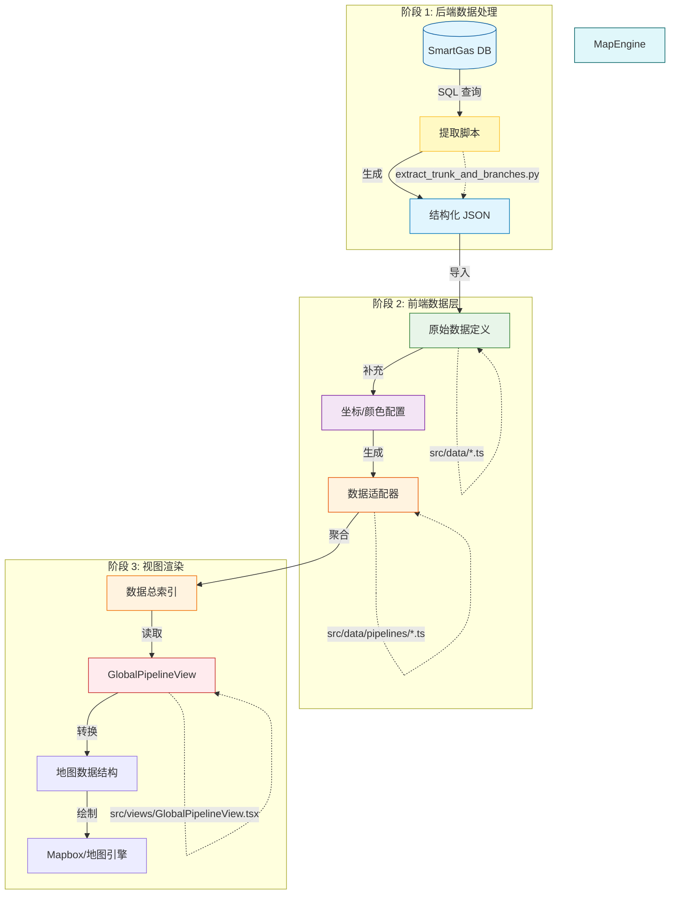

# 管线数据流向解析 (Data Flow)

本文档解释了数据如何从后端数据库一步步转化为前端地图上的可视化图形。

## 整体流程图 (Process Overview)

---

## 详细步骤解析

### 1. 数据库 (Database)
- **来源**: `backend/data/smartgas.db`
- **内容**: 存储了所有管线节点、连接关系、里程值等原始数据。
- **表**: `node_relation_details`

### 2. 提取脚本 (Extraction Script)
- **工具**: `backend/scripts/extract_trunk_and_branches.py`
- **作用**: 
    1. 从数据库读取节点。
    2. 根据 `branch_name` 智能识别干线和支线。
    3. 按里程排序，构建拓扑结构。
- **输出**: `backend/data/we2_structure.json` (JSON 文件)

### 3. 数据定义 (.ts)
- **文件**: `src/data/westEast2Data.ts`
- **作用**: 
    1. 将 JSON 数据硬编码或导入为 TypeScript 数组。
    2. **关键步骤**: 手动补充缺失的经纬度坐标 (因为数据库里通常只有里程，没有坐标)。
    3. 定义管线颜色、粗细等样式。

### 4. 数据适配器 (Pipeline Adapter)
- **文件**: `src/data/pipelines/we2.ts` (标准化重构后的核心)
- **作用**: 将上述原始数据转换为系统统一的 `PipelinePackage` 格式。
    - 无论原始数据长什么样（数组、对象、图形），在这里都被“清洗”成标准格式。

### 5. 视图组件 (View Component)
- **文件**: `src/views/GlobalPipelineView.tsx`
- **作用**: 
    1. 从 `src/data/pipelines/index.ts`读取所有已注册的管线包。
    2. 根据用户的交互（勾选/折叠），动态筛选出需要显示的数据。
    3. 将筛选后的数据传递给地图组件。

### 6. 地图渲染 (Map Rendering)
- **组件**: `MapView` -> `SimpleMap`
- **作用**: 
    - 接收点 (Nodes) 和线 (Lines) 数据。
    - 调用底层地图库（如 Mapbox GL JS 或类似的 Canvas 绘图引擎）在屏幕上画出图形。
    - 处理缩放、平移等交互。
