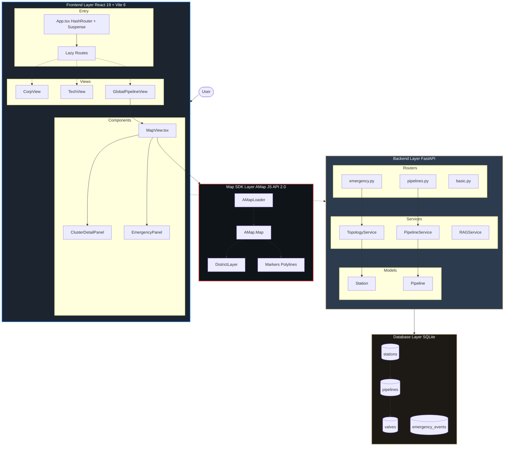

# SmartGas Grid 智慧管网系统 - 完整架构图

## 系统架构概览

```
┌─────────────────────────────────────────────────────────────────────────┐
│                         SmartGas Grid 架构图                            │
├─────────────────────────────────────────────────────────────────────────┤
│                                                                         │
│   ┌───────────┐                                                         │
│   │   User    │                                                         │
│   │ 用户/调度员 │                                                        │
│   └─────┬─────┘                                                         │
│         │                                                               │
│         ▼                                                               │
│   ┌─────────────────────────────────────────────────────────────────┐  │
│   │                      Frontend Layer                             │  │
│   │                   React 19 + Vite 6 + TypeScript                │  │
│   ├─────────────────────────────────────────────────────────────────┤  │
│   │  ┌─────────────┐  ┌─────────────┐  ┌─────────────────────────┐  │  │
│   │  │   Router    │  │    Views    │  │       Components        │  │  │
│   │  │ HashRouter  │──│ CorpView    │──│ MapView.tsx             │  │  │
│   │  │  Routes     │  │ TechView    │  │ ClusterDetailPanel      │  │  │
│   │  │  Suspense   │  │ GlobalView  │  │ EmergencyPanel          │  │  │
│   │  └─────────────┘  └─────────────┘  └─────────────────────────┘  │  │
│   │  ┌─────────────┐  ┌─────────────┐  ┌─────────────────────────┐  │  │
│   │  │   Utils     │  │    Data     │  │       Hooks             │  │  │
│   │  │ mapRenderer │  │ PipelineData│  │ useState/useEffect      │  │  │
│   │  │ dataLoader  │  │ StationData │  │ useRef/useCallback      │  │  │
│   │  └─────────────┘  └─────────────┘  └─────────────────────────┘  │  │
│   └─────────────────────────────────────────────────────────────────┘  │
│                              │                                          │
│                              ▼                                          │
│   ┌─────────────────────────────────────────────────────────────────┐  │
│   │                      Map SDK Layer                              │  │
│   │                     高德地图 JS API 2.0                          │  │
│   ├─────────────────────────────────────────────────────────────────┤  │
│   │  AMapLoader → AMap.Map → DistrictLayer → Markers/Polylines     │  │
│   └─────────────────────────────────────────────────────────────────┘  │
│                              │                                          │
│                              ▼                                          │
│   ┌─────────────────────────────────────────────────────────────────┐  │
│   │                      Backend Layer                              │  │
│   │                  FastAPI + Python + NetworkX                    │  │
│   ├─────────────────────────────────────────────────────────────────┤  │
│   │  ┌─────────────┐  ┌─────────────┐  ┌─────────────────────────┐  │  │
│   │  │   Routers   │  │  Services   │  │        Models           │  │  │
│   │  │  basic.py   │  │PipelineSvc  │  │  Station (SQLModel)     │  │  │
│   │  │emergency.py │  │TopologySvc  │  │  Pipeline (SQLModel)    │  │  │
│   │  │pipelines.py │  │   RAGSvc    │  │  Emergency (Pydantic)   │  │  │
│   │  └─────────────┘  └─────────────┘  └─────────────────────────┘  │  │
│   └─────────────────────────────────────────────────────────────────┘  │
│                              │                                          │
│                              ▼                                          │
│   ┌─────────────────────────────────────────────────────────────────┐  │
│   │                     Database Layer                              │  │
│   │                  SQLite + SQLModel + ChromaDB                   │  │
│   ├─────────────────────────────────────────────────────────────────┤  │
│   │  stations ↔ pipelines ↔ valves + details + emergency_events    │  │
│   └─────────────────────────────────────────────────────────────────┘  │
│                                                                         │
└─────────────────────────────────────────────────────────────────────────┘
```

---

## 详细架构图 (Mermaid)



---

## 前端 React 架构特征

### 1. React 18+ Root API
```tsx
// main.tsx
import { createRoot } from 'react-dom/client'
const root = createRoot(rootElement)
root.render(<App />)
```

### 2. 函数组件 + Hooks
```tsx
// App.tsx
const App: React.FC = () => { ... }
const [state, setState] = useState(null)
useEffect(() => { ... }, [])
useCallback(() => { ... }, [])
```

### 3. React.lazy + Suspense 代码分割
```tsx
const CorpView = lazy(() => import('./views/CorpView'))
<Suspense fallback={<PageLoader />}>
  <Routes>...</Routes>
</Suspense>
```

### 4. React Router v6
```tsx
import { HashRouter, Routes, Route, useNavigate } from 'react-router-dom'
<HashRouter>
  <Route path="/" element={<CorpView />} />
</HashRouter>
```

---

## 后端 FastAPI 架构

### 分层结构
```
main.py (FastAPI App)
├── api/
│   ├── basic.py (CRUD API)
│   ├── emergency.py (Emergency API)
│   └── pipelines.py (Pipeline API)
├── services/
│   ├── pipeline_service.py
│   ├── topology_service.py (NetworkX)
│   └── rag_service.py (ChromaDB + Gemini)
├── models/
│   ├── station.py (SQLModel)
│   └── pipeline.py (SQLModel)
└── db/
    └── session.py
```

---

## 数据库架构

### ER 关系
```
stations (1:N) pipelines
pipelines (1:N) node_relations
trunk_details (1:N) branch_details
```

### 核心表
- `stations` - 站场基础信息
- `pipelines` - 管线基础信息
- `valves` - 阀室信息
- `emergency_events` - 应急事件

---

## 数据流示例

### 场景: 路径分析
```
User Click 
  -> Frontend (React State)
  -> POST /api/emergency/route-analysis
  -> Backend (TopologyService)
  -> NetworkX Graph Build
  -> Dijkstra Shortest Path
  -> JSON Response
  -> Frontend Update Map
```

---

*Generated: 2026-02-14*
