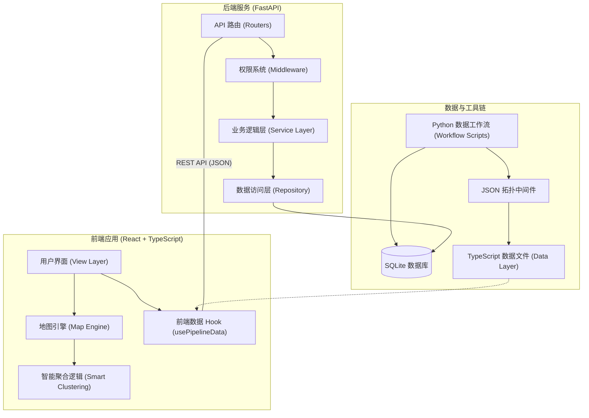

# 管道全生命周期管理系统 (Pipeline Master System) 解决方案

## 1. 项目背景与现状

在油气管道工业领域，管道拓扑的数字化与可视化是实现生产调度、完整性管理的关键。然而，在 **SmartGas Grid** 项目的实际开发中，我们面临着来自底层数据的严峻挑战。

### 核心痛点
1.  **拓扑数据混乱**：数据库中干线与支线混杂，物理分段（如新疆段、甘肃段）的里程独立计算，导致原始数据在全局维度下缺乏逻辑连续性。
2.  **可视化排序陷阱**：直接提取出的坐标序列往往因批次或存储顺序导致“跳跃”。例如，新疆段后的节点可能直接连向数千公里外的中卫段，导致地图上出现错误的跨区域直线。
3.  **视觉重叠问题**：多条管线在“合建站”或“交叉点”共享同一物理坐标，传统渲染方式会导致多个图标重叠，用户无法区分具体场站归属。

## 2. 系统整体架构

本系统采用现代化的前后端分离架构，通过自动化的数据流水线将地理信息与业务逻辑深度解耦。

## 3. 技术方案细节 (三阶段流水线)

### 阶段一：智能拓扑提取 (Smart Extraction)
系统通过 Python 脚本实现对数据库的深度扫描，利用正则表达式和业务逻辑字段进行自动分类。
-   **提取逻辑**：基于 `branch_name` 包含“干线”字样识别主干，其余自动归入对应支线集合。
-   **结构化输出**：生成包含 `trunk`、`branches` 及映射关系的 JSON 中间件，为后续转换夯实基础。

### 阶段二：高精度数据转换 (High-Precision Transformation)
这是解决“排序陷阱”的关键层。我们引入了 **双重权值排序算法**。
-   **排序预处理**：在地理坐标插值前，系统定义了全局地理段序（如：`新疆 -> 甘肃 -> 宁夏 -> ...`）。
-   **算法公式**：`GlobalOrder = SegmentPriority * 10^6 + LocalMileage`。
-   **线性插值**：针对仅有部分坐标的阀室，利用已知场站坐标进行经纬度线性平滑补全，确保连线契合地理走势。

### 阶段三：智能聚合渲染 (Smart Layered Clustering)
前端采用 **Smart Layered Clustering** 算法，解决空间冲突。
-   **坐标指纹聚合**：基于经纬度 6 位小数精度生成哈希指纹，将同坐标的多个场站/交叉点自动分组。
-   **动态交互模式**：
    -   **低缩放级别**：显示聚合统计图标（如“5个系统站点”）。
    -   **高缩放级别**：触发 **螺旋展开 (Spiral Explosion)** 效果，将重叠站点沿圆周展开，使各管线站点清晰可见。

---

## 3. 方案价值

1.  **数据原子化**：将复杂的 GIS 逻辑封装在自动化脚本中，减少人工录入成本。
2.  **视觉无瑕疵**：通过排序补偿机制，彻底解决了管道连线“乱拉线”的顽疾。
3.  **交互智能化**：分层聚合技术显著提升了在高密度区域的操作体验，满足了业务人员对细部查看的要求。

---

> [!NOTE]
> 本方案已集成至 `.agent/skills/pipeline-master-system`，支持一键式工作流执行。
