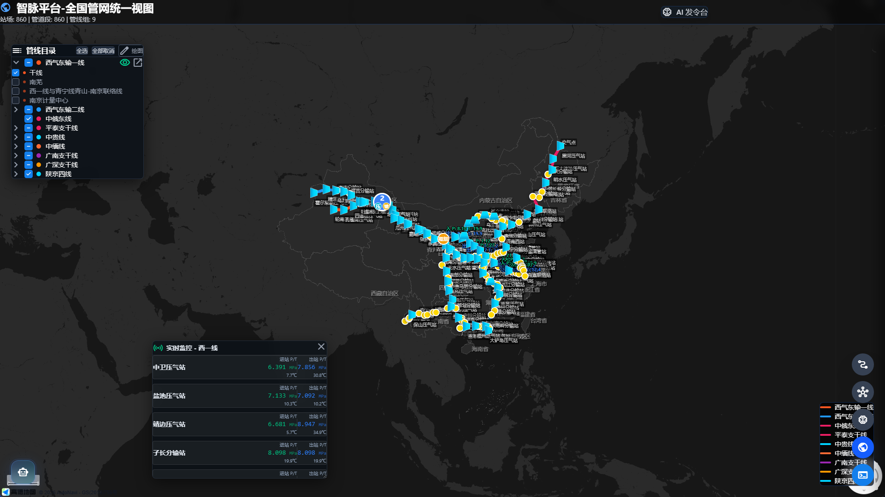

# 业务痛点分析与赛题提案

**赛题名称提案：** 基于大模型的复杂天然气管网智能调度与决策辅助系统

---

## 一、 业务背景介绍
随着“全国一张网”战略的推进与省级天然气管网规模的高速扩张，输气管网的物理拓扑（干线、支线、压气站、分输站、阀室交织串联）与运行工况（多气源接入、分时分段调峰、冬夏峰谷切换）日益复杂。

在日常生产中，省管网/国家管网调度中心承担着保障能源平稳输送、优化排产以及突发险情应急处置的核心职能。然而，当前高度依赖“纯人工经验+传统 SCADA 监控”的调度模式正面临严重的“能力天花板与安全瓶颈”，亟需引入大模型原生（AI-Native）理念，将“被动响应的操作系统”升级为“主动决策支持的智能平台”。

---

## 二、 核心业务痛点分析与解决方式展示

我们提炼了当前一线调度业务中最亟待解决的四大痛点：**“看不全”、“查得慢”、“编得累”和“算不透”**，并在本系统中逐一给出了智能化解决方案。

### 痛点一：多管线统筹监控面临“信息割裂”，导致“看不全”与盲区隐患
* **痛点现象**：一个调度长在值班期间往往需要统揽多个区域调度台。但现有的工业监控界面布局死板、信息展示割裂，调度长必须在不同画面或大屏间频繁切换。
* **对效率/安全的影响**：
  * **效率影响**：频繁的“人肉巡视”极大消耗精力，日常监管疲于奔命。
  * **安全影响**：在多点并发异常下，调度员承受极高的瞬时认知负荷（Cognitive Load），极易爆发现场监控盲区与响应迟滞。
* **本系统的解决方式（AI 智能驾驶舱）**：
  * **核心功能**：构建基于意图理解的 AI 动态智能驾驶舱。打破传统组态固定模式，由大模型根据管网风险等级及指令，秒级动态组装“最紧急、最相关”的数据面板，实现“高优工况主动推优展示”。

**【解决方式系统截图与说明】**
> *此处请插入：主界面/带分屏或聚合监控模块的UI截图*

> **截图说明**：如上图所示，系统突破了固定界面的局限，可将相关的站场详情、核心参数流向以及异常指标（如红色报警区域）在一个全景视角中同时并列展示，彻底消除了调度人员视线来回切换的盲区。

---

### 痛点二：海量运维数据成为“死库”，导致“查得慢”与应急延误
* **痛点现象**：系统沉淀了海量的设备台账、运行规程与应急预案，但无法支持如“时间范围+特定设备状态+特定流程”这类复合型交叉查询。
* **对效率/安全的影响**：
  * **效率影响**：人工翻找资料与跨部门沟通耗时巨大。
  * **安全影响**：当遭遇紧急抢险情况时，一分钟的检索迟滞就可能错过最佳截断关阀的黄金时间，将小事故拖延放大。
* **本系统的解决方式（工业领域自然语言极速检索引擎）**：
  * **核心功能**：打通异构数据，引入 NL2SQL + RAG 技术。调度员仅需自然语言输入（例：“调出3号干线昨日下午压降超5%的阀室预案”），AI 即可在一秒内综合返回精准的参数点、图文段落以及合规流程指引。

**【解决方式系统截图与说明】**
> *此处请插入：侧边栏 AI 助手 / 对话搜索框，进行复杂自然语言查询并返回精准预案的截图*

> **截图说明**：图中展示了系统基于 RAG 引擎的深度信息穿透能力。当用户输入复杂的时空状态混合口语指令时，系统不仅瞬间锁定了目标设备，还精准提取并呈现了相关的标准应急防冻堵预案内容，为秒级抢险决策赢得了时间。

---

### 痛点三：高水平操作仍强依赖“老专家”，方案“编得累”且缺乏规制
* **痛点现象**：日常气源切换、站场检修或管线升降压，需要编制复杂严谨的操作指令。这重度依赖老专家手工敲字、反复斟酌推演。
* **对效率/安全的影响**：
  * **效率影响**：撰写与校验长篇幅的操作指令往往耗费调度中心数个小时以上的时间成本。
  * **安全影响**：不同人撰写的指令逻辑存在差异，新手极易盲目照搬，从而埋下严重的合规违规风险及安全阀越限风险。
* **本系统的解决方式（懂管网拓扑的智能调度方案生成 Agent）**：
  * **核心功能**：系统内置多种安全模板与拓扑规则库。AI 自动推演流向，输出合规的、详尽分布的操作指导步骤，并进行冲突检测，人工只需退居做最终“签字审核”。

**【解决方式系统截图与说明】**
> *此处请插入：工作流生成界面 (WorkflowEditor) 或 AI 生成复杂排产指令清单的截图*

> **截图说明**：通过图中的智能工作流 Agent，过去的纯人工零散编写变为标准化、引擎驱动的一键式生成。方案不仅内置了领域规则，还能规避由于个人经验盲区造成的违规操作，充分实现了默会知识的数字化传承。

---

### 痛点四：海量时序信号缺乏深度挖掘，设备风险“算不透”与预防难
* **痛点现象**：绝大部分系统对高频的 SCADA 采集信号仅用来画个死版的“实时曲线图”。
* **对效率/安全的影响**：
  * **效率影响**：事后的周报、月报生成，以及异常回溯定位，严重依赖人工下载报表去拉公式比对。
  * **安全影响**：陷入“触发高低报警阈值”被动出警模式，极难捕捉隐性性能衰减趋势和微漏，做不到防患于未然。
* **本系统的解决方式（管网异构数据洞察与预测 AI 分析师）**：
  * **核心功能**：AI 默默在后台监听高频时序数据，进行多变量异常关联特征诊断。支持根据用户口语指令一键生成洞察图表与预测性对标报告。

**【解决方式系统截图与说明】**
> *此处请插入：数据图表界面 (TechView 中的图表) 结合 AI 生成洞察报告分析的截图*

> **截图说明**：图中展示的前端洞察面板不再满足于单纯显示即时状态，而是配合 AI 将海量时序信号转化为可视化的趋势对比与隐患警示折线，让原本沉默的死数据转化为预测预防的有力武器。

---

## 三、 赛题提案总体价值总结

本提案直击天然气管网日常调度中**“看不全、查得慢、编得累、算不透”**四大症结。

基于大模型、多智能体协作与 RAG 技术，本系统有望大幅消解一线调度人员的信息焦虑，显著降低误操作及迟报带来的隐性安全风险（实现**本质安全**），并在排产方案编制以及海量数据应用层面取得破局（实现**降本增效**）。这是一项立足于核心业务痛点、具备极高可落地性与重构行业生产力潜力的智能化创新实践。
