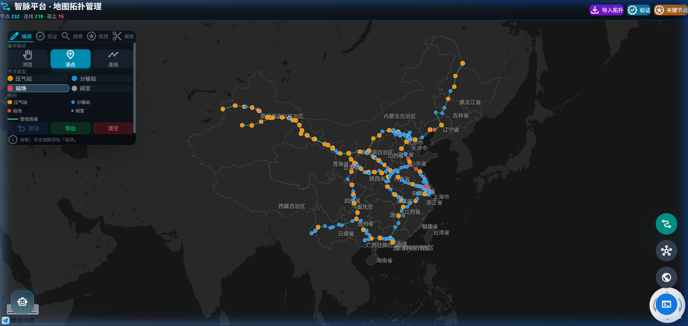
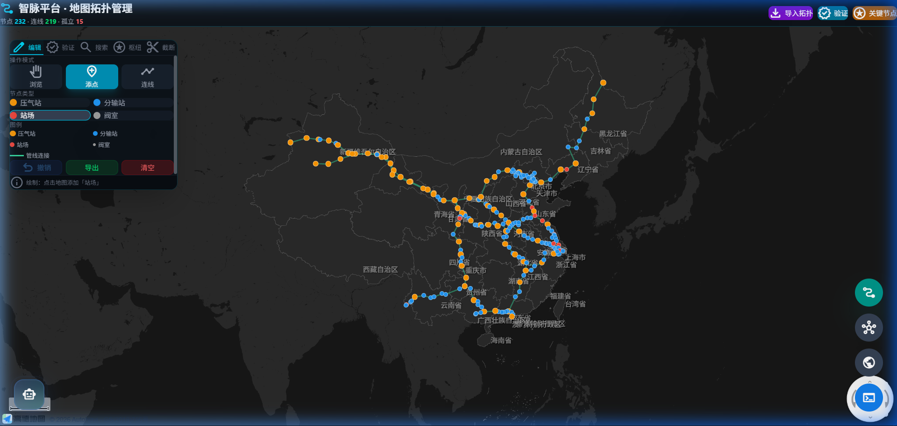
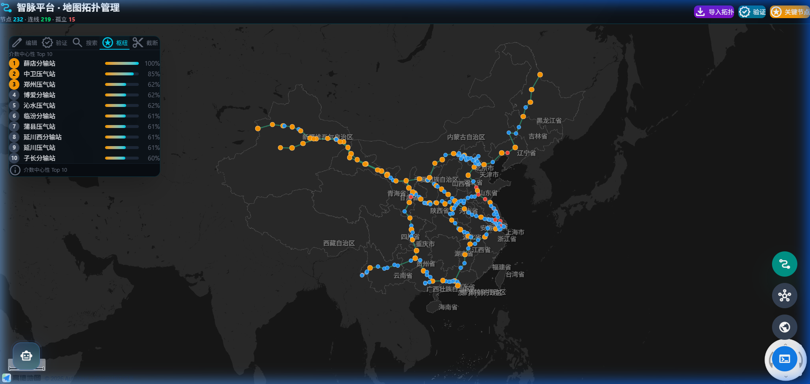
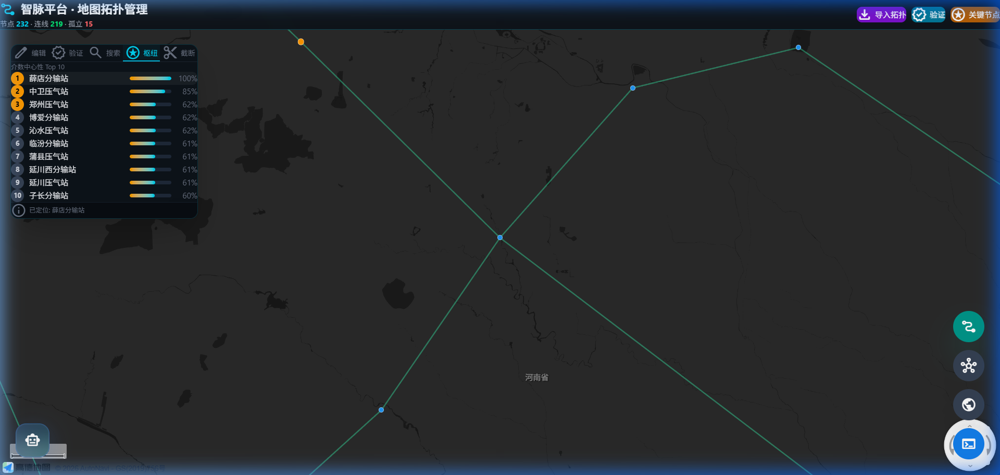

# 智脉平台 · 地图拓扑管理 — 操作说明

## 一、进入方式

访问地址：`http://localhost:3000/#/map-topo`

也可从左下角导航按钮进入「地图拓扑管理」页面。

---

## 二、界面总览

进入后点击右上角 **「导入拓扑」** 按钮，系统自动加载数据库中的管线数据并渲染为拓扑图。

界面分为 4 个区域：
- **顶部工具栏**：导入拓扑、验证、关键节点
- **左侧面板**：编辑 / 验证 / 搜索 / 枢纽 / 截断 五个标签页
- **中心地图**：拓扑节点和连线
- **右侧浮动按钮**：视图切换

---

## 三、编辑操作

### 3.1 添加节点

1. 左侧 → **编辑** → 操作模式 → 点击 **「添点」**
2. 选择节点类型（压气站 / 分输站 / 站场 / 阀室）
3. **点击地图**即可放置节点
4. 节点支持拖拽调整位置

### 3.2 连接管线

1. 操作模式 → 点击 **「连线」**
2. 先 **点击起点节点**
3. 再 **点击终点节点**
4. 两点之间自动生成连线

### 3.3 撤销操作

- **快捷键**：`Ctrl + Z`（随时可用）
- **按钮**：左侧面板底部 **「撤销(N)」** 按钮
- **智能清理**：撤销节点时自动删除关联的所有连线
- 按钮显示可撤销操作数量，如 **撤销(3)**

### 3.4 导出 / 清空

| 按钮 | 功能 |
|------|------|
| **导出** | 将当前拓扑导出为 JSON 文件 |
| **清空** | 清除地图上所有节点和连线 |

---

## 四、枢纽节点说明

系统会自动识别管网中的**枢纽节点**——连接管线多、位于关键位置的站场。

### 4.1 枢纽类型

| 类型 | 图标 | 含义 | 判定条件 |
|------|------|------|---------|
| **跨管线枢纽** | 🔷 青色菱形 + 脉冲动画 | 连接不同管线系统 | 录入 `junction_groups` 表 |
| **管内枢纽** | 🟡 金色菱形 | 干线/支线分叉点 | 度数 ≥ 3 且非阀室 |
| 压气站 | 🟠 橙色梯形 | 天然气增压 | 名称含"压气站" |
| 分输站 | 🔵 蓝色 / 🟡 金色圆点 | 天然气分配 | 名称含"分输站" |
| 阀室 | ⚪ 灰色小点 | 阀门控制 | 名称含"阀室" |

### 4.2 关键节点分析

点击右上角 **「关键节点」** 按钮，系统基于**介数中心性**算法计算 Top 10 关键站场：

排名靠前的站场（如薛店分输站 100%、中卫压气站 85%）是全网最关键的枢纽，一旦中断将影响最多路径。

### 4.3 主要枢纽一览

| 枢纽 | 连接管线 | 度数 | 意义 |
|------|---------|------|------|
| **中卫** | WE1 ↔ WE2 ↔ ZG | 5 | 全网最大枢纽，三线汇聚 |
| **靖边** | SJ4 ↔ WE1 | 2 | 陕京系统与西一线交汇 |
| **哈密** | WE1 ↔ WE2 | 2 | 西一/西二新疆段并行 |
| **广州** | WE2 ↔ GN ↔ GS | 3 | 珠三角枢纽 |
| **贵阳** | ZG ↔ ZM | 3 | 西南枢纽 |
| **薛店** | WE1 ↔ PT | 4 | 介数中心性最高 |
| **泰安** | CRED ↔ PT | 3 | 中俄东线与平泰交汇 |

### 4.4 枢纽节点详情

点击枢纽列表中的站场名，地图会自动定位到该节点：

---

## 五、截断仿真

1. 左侧面板 → **截断** 标签页
2. 搜索或点击选择截断节点
3. 点击 **「执行截断分析」**
4. 查看结果：
   - 失联节点列表
   - 替代路径是否存在
   - 受影响区域

---

## 六、快捷键

| 快捷键 | 功能 |
|--------|------|
| `Ctrl + Z` | 撤销上一步操作 |
| 鼠标滚轮 | 地图缩放 |
| 鼠标拖拽 | 浏览模式下移动地图 |
