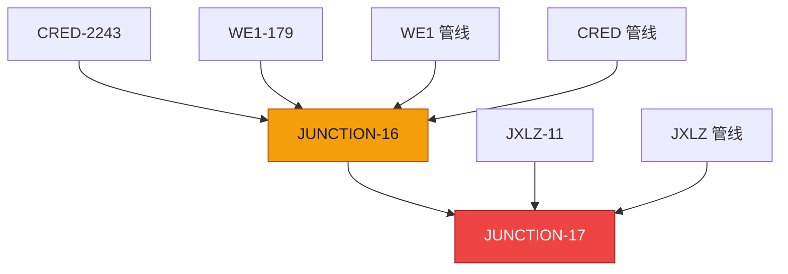
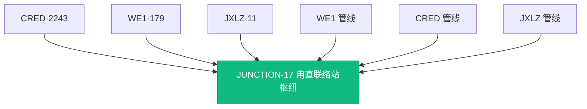

# 枢纽统一逻辑说明

> 这份文档用大白话说明一个问题：  
> 为什么地图拓扑页里明明已经把几个站点“捏合”成一个枢纽了，但全国管网统一视图里看起来还是分开的。  
> 以及，我们现在是怎么把这个问题修好的。

---

## 一、先说结论

这次修的不是“界面画图没画好”，而是**数据没有统一**。

之前的问题是：

- 地图拓扑页里，用户把几个站点捏合成了一个枢纽
- 但全国统一视图读取的是后端打包出来的数据
- 这个数据里，甪直相关的几条线并没有真的指向同一个枢纽节点

所以结果就是：

- 在拓扑页里看着像已经合并了
- 在全国图里看起来还是分开的

现在修完以后：

- 甪直相关站点会先在后端做一次“归一化”
- 所有相关管线会统一指向同一个枢纽
- 前端缓存也会刷新
- 所以地图拓扑页和全国统一视图终于能看到同一个结果

---

## 二、这个问题到底是怎么来的

简单说，之前系统里出现了“**枢纽套枢纽**”。

举个真实的例子：

第一次捏合时，生成了一个枢纽：

```text
JUNCTION-16 = [CRED-2243, WE1-179]
```

后来又做了一次捏合，但这次不是直接选真实站点，而是把上一次生成的 `JUNCTION-16` 又拿来继续捏合：

```text
JUNCTION-17 = [JUNCTION-16, JXLZ-11]
```

这样就出问题了。

因为在系统里：

- 有些线还连着 `JUNCTION-16`
- 有些线已经连着 `JUNCTION-17`

从界面上看，就像“没有真正合成一个点”。

---

## 三、用一张图看明白



这张图表达的意思很简单：

- `WE1` 和 `CRED` 还挂在老枢纽 `JUNCTION-16`
- `JXLZ` 挂在新枢纽 `JUNCTION-17`

所以全国统一视图看到的当然还是两个点，而不是一个点。

---

## 四、我们现在怎么修

这次修复分成了三层。

### 1）后端先把脏数据理顺

后端新增了一层“枢纽归一化”逻辑。

它会做几件事：

- 如果发现某个枢纽里写的是 `JUNCTION-16` 这种虚拟节点
- 就继续往下展开
- 把它还原成真正的底层站点
- 如果几个枢纽本来就是一组有交集的数据，就自动把它们并成一组

说白了就是：

> 不管历史上你怎么捏过，只要最后这些站点本来应该属于同一个枢纽，后端就把它们整理成一组。

---

### 2）全国视图不再直接信原始枢纽表

以前全国统一视图打包时，拿的是原始枢纽数据。

现在改成：

- 先读取“归一化后的枢纽组”
- 再生成全国统一视图要用的枢纽节点
- 再把相关线段的起点、终点统一改到这个枢纽节点上

这样一来：

- `WE1`
- `CRED`
- `JXLZ`

这些线都会指向同一个最终枢纽。

---

### 3）前端也不再继续制造脏数据

这一步很重要。

如果只是后端能修历史数据，但前端还允许用户把“已经捏好的枢纽”继续当普通点拿去捏，那以后还是会不断产生新的脏数据。

所以现在前端改成了：

- 用户点普通站点：正常加入捏合列表
- 用户点已捏合的枢纽：不直接拿这个枢纽 ID 去保存
- 而是自动展开成它底下的真实站点 ID，再参与捏合

意思就是：

> 前端以后尽量只提交真实站点，不再把“虚拟枢纽节点”继续往库里写。

---

## 五、整个流程现在长什么样


你可以把它理解成一句话：

> 地图拓扑页做完捏合后，不只是前端自己记一下，而是后端会重新整理一遍数据，再把全国统一视图要用的包重新生成。

---

## 六、甪直这个案例，修完后是什么样

修完之后，甪直相关的几个站点会被统一收敛成同一个枢纽。

也就是：

- `CRED-2243`
- `WE1-179`
- `JXLZ-11`

最后都会归到同一个点上。

图上就是这样：



这时候全国统一视图看到的就是一个真正统一的枢纽，而不是两个分开的点。

---

## 七、为什么之前“看起来没生效”

还有一个很常见的问题是：**缓存没刷新**。

全国统一视图用的是打包数据，如果捏合之后前端还在用旧缓存，那就会出现：

- 后端其实已经改对了
- 但界面还在显示旧结果

所以这次也补了缓存失效逻辑：

- 创建枢纽后，清掉旧的管线缓存
- 删除枢纽后，也清掉旧缓存
- 下次再进全国统一视图时，就会重新取最新数据

---

## 八、现在已经验证过什么

这次不是只改代码，没有验证。

已经做过这些检查：

### 1）后端编译检查通过

检查过的文件包括：

- `backend/app/services/junction_groups.py`
- `backend/app/routers/pipeline_packages.py`
- `backend/app/routers/topology_editor.py`
- `backend/app/services/topology.py`

### 2）前端构建通过

前端已经执行过构建，能成功打包。

### 3）甪直数据回放通过

回放结果确认：

- 相关线段最终都只指向 `JUNCTION-17`
- 不再同时出现 `JUNCTION-16` 和 `JUNCTION-17` 各管一部分线的情况

也就是说，这次问题已经不是“理论上修了”，而是**实际数据已经验证通过**。

---

## 九、这次到底改了哪些地方

### 后端

#### 1. `backend/app/services/junction_groups.py`

作用：

- 解析枢纽组
- 展开 `JUNCTION-x`
- 合并有交集的枢纽组
- 产出统一后的有效枢纽

这是这次修复的核心。

#### 2. `backend/app/routers/pipeline_packages.py`

作用：

- 全国统一视图的数据从这里出来
- 现在它会使用“归一化后的枢纽组”
- 把管线起点终点统一映射到同一个枢纽节点

#### 3. `backend/app/routers/topology_editor.py`

作用：

- 地图拓扑页创建 / 删除枢纽时走这里
- 现在创建时会先展开嵌套枢纽引用
- 操作后还会刷新拓扑缓存

---

### 前端

#### 4. `src/views/MapTopologyView.tsx`

作用：

- 地图拓扑页上的捏合逻辑在这里
- 现在点到一个“已捏合枢纽”时，会自动展开到底层真实站点
- 避免再次造出“枢纽套枢纽”

#### 5. `src/data/pipelines/index.ts`

作用：

- 负责全国包缓存
- 创建 / 删除枢纽后会清理缓存

---

## 十、现在可以怎么理解这个修复

以前的问题是：

> 界面上看像捏合了，但全国图用的数据没有真正统一。

现在的逻辑是：

> 只要你在地图拓扑页做了捏合，后端会把这件事真正落实到全国统一视图要用的数据里。

所以现在两个视图看到的结果才会一致。

---

## 十一、一句话总结

一句最人话的说法：

> 以前只是“这个页看起来合上了”，现在是“整个系统都认这几个点已经合成一个枢纽了”。

---

## 十二、后面建议再补两件事

如果要让这块更稳，建议下一步做两件事：

### 1）补自动化回归测试

目的：

- 防止以后改代码时，这个问题又回来

### 2）补历史脏数据清理脚本

目的：

- 扫描旧库里还有没有类似 `JUNCTION-x` 套 `JUNCTION-y` 的数据
- 有的话自动整理

---

## 十三、文档用途

这份文档适合给三类人看：

- 产品：理解为什么之前两个视图不一致
- 开发：知道修复点在哪几层
- 领导 / 汇报场景：能快速看懂问题、方案、结果

