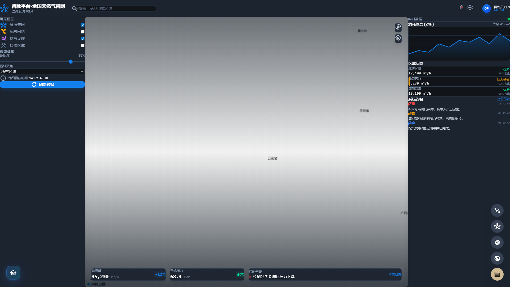
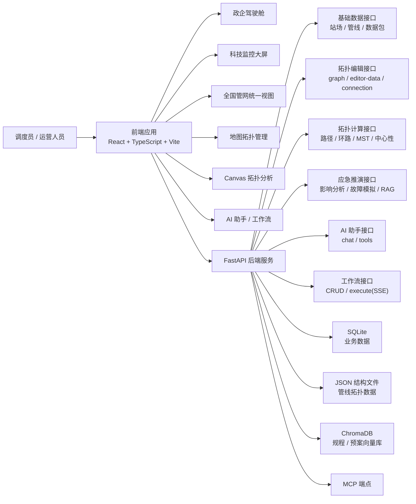
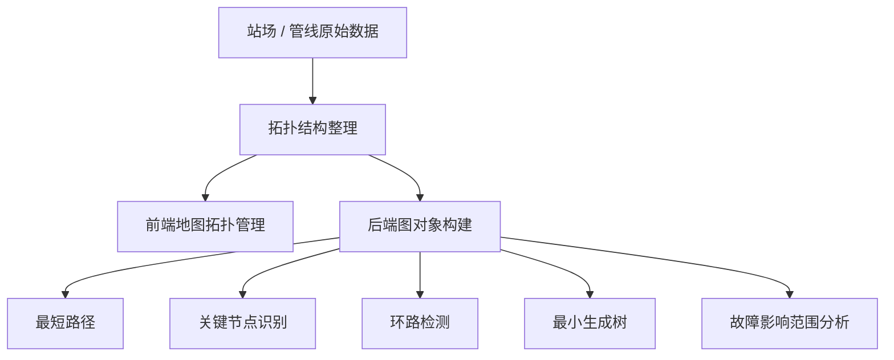
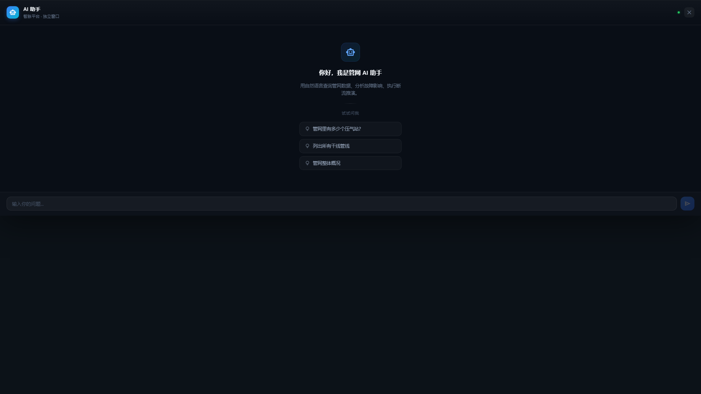
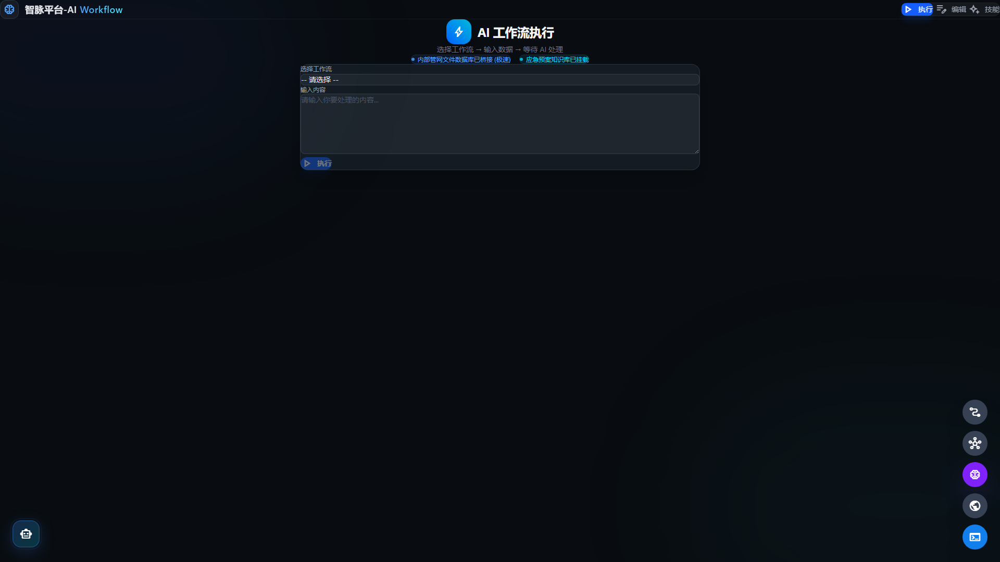
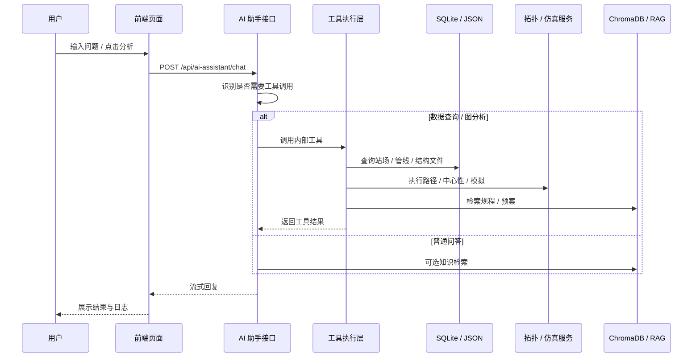
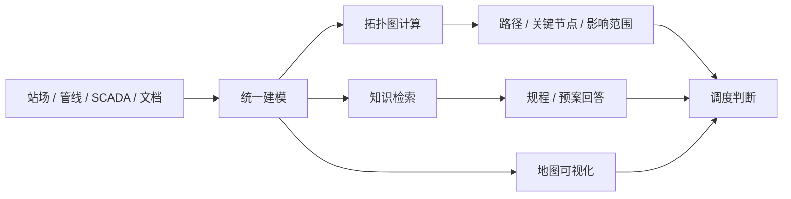

# 智脉平台（SmartGas）项目整体说明

> 面向天然气长输管网的 **可视化监测、拓扑分析、应急推演、AI 检索问答与工作流编排** 一体化平台。  
> 本说明基于当前仓库代码结构整理，适合用于项目介绍、交接阅读和方案汇报。



---

## 1. 项目定位

### 一句话说明

**智脉平台** 是一个围绕天然气管网运行场景构建的综合系统：  
前端负责地图大屏、全国管网、拓扑编辑与 AI 交互；后端负责基础数据服务、拓扑建模、图算法分析、断流推演、知识检索与 AI 工作流执行。

### 它解决什么问题

| 业务痛点 | 项目能力 | 落地方式 |
| --- | --- | --- |
| 管网跨区域、跨系统，人工难以“一眼看全” | 全国管网统一地图视图 | 高德地图 + 管线数据包加载 |
| 共享站点、支线、阀室关系复杂，结构不清 | 拓扑图构建与校验 | Map 拓扑管理 + Canvas 拓扑分析 |
| 故障影响范围需要快速判断 | 断流推演与路径分析 | NetworkX 图计算 + 仿真引擎 |
| 规程、预案、设备知识分散 | AI 检索问答 | RAG + 向量库 + 工具调用 |
| 复杂分析步骤依赖人工串联 | AI 工作流编排 | 工作流 CRUD + SSE 流式执行 |

---

## 2. 一图看懂系统



### 核心特点

- **一套前端，多种视角**：既有面向展示的驾驶舱，也有面向分析的技术视图和拓扑画布。
- **一套后端，多类能力**：既提供 REST API，也提供图算法、RAG 和 AI 工作流。
- **数据形态混合**：同时使用 SQLite、JSON 结构文件、向量库和环境变量配置。
- **既能“看”，也能“算”**：不仅展示地图，还能做路径、关键节点、断流传播与影响分析。

---

## 3. 前端整体结构

前端是项目的“可视化外壳”，主要负责把复杂管网数据以更直观的方式呈现出来。

### 页面层

当前主应用通过 `HashRouter` 管理多个视图：

| 页面/视图 | 作用 | 典型文件 |
| --- | --- | --- |
| 政企驾驶舱 | 面向汇报与业务展示的总览页 | `src/views/CorpView.tsx` |
| 科技监控大屏 | 面向运行监控的技术视图 | `src/views/TechView.tsx` |
| 全国管网统一视图 | 多管线系统统一地图展示、SCADA 面板、详情下钻 | `src/views/GlobalPipelineView.tsx` |
| 地图拓扑管理 | 在地图坐标系上进行节点/连线的管理与校验 | `src/views/MapTopologyView.tsx` |
| Canvas 拓扑图 | 用更抽象的图结构视角分析网络关系 | `src/views/TopologyView.tsx` |
| 拓扑演示页 | 演示路径、环路、最小生成树等能力 | `src/views/TopologyDemoView.tsx` |

### 组件层

前端核心组件大致分为 5 类：

| 组件类别 | 说明 | 代表目录 |
| --- | --- | --- |
| 地图渲染 | 负责高德地图初始化、图层、标注、聚合、设备显示 | `src/components/map-view` |
| AI 助手 | 提供浮动对话面板、流式输出、工具日志展示 | `src/components/ai-assistant` |
| 拓扑分析 | 提供拓扑图展示、路径高亮、指标卡片 | `src/components/topology` |
| 工作流编排 | 提供工作流编辑、执行和流式反馈 | `src/components/workflow` |
| SCADA 图表 | 站场历史曲线与监测详情 | `src/components/scada` |

### 前端技术亮点

- 采用 `React + TypeScript + Vite`，开发体验轻量，打包速度快。
- `App.tsx` 对视图使用 `lazy + Suspense`，做了路由级懒加载。
- `MapView.tsx` 内部对高德地图初始化、控件加载、区域图层、批量渲染做了封装。
- 通过 `src/data/pipelines/index.ts` 统一从后端拉取管线数据包，并做 **跨管线节点去重**。
- 通过 `useTopology` Hook，把前端图数据转换为后端可计算的拓扑结构。

---

## 4. 后端整体结构

后端是项目的“计算与服务中台”，核心职责是：**数据组织、拓扑计算、AI 编排、推演分析、知识检索**。

### 路由层

| 路由模块 | 功能 | 典型路径 |
| --- | --- | --- |
| 基础数据 | 站场、管线基础查询 | `backend/app/routers/basic.py` |
| 应急模块 | 路径分析、影响分析、知识问答、断流模拟 | `backend/app/routers/emergency.py` |
| AI 助手 | 流式聊天、工具调用 | `backend/app/routers/ai_assistant.py` |
| 工作流 | 工作流的增删改查与流式执行 | `backend/app/routers/workflow.py` |
| 拓扑编辑 | 编辑器数据、连接创建、拓扑图输出 | `backend/app/routers/topology_editor.py` |
| 拓扑计算 | 构图、最短路、多路径、环检测、MST、中心性 | `backend/app/routers/topology_computation.py` |
| SCADA | 监测与集成能力入口 | `backend/app/routers/scada.py` |
| 管线数据包 | 按系统/图层输出前端可直接使用的数据 | `backend/app/routers/pipeline_packages.py` |

### 服务层

| 服务模块 | 作用 | 典型文件 |
| --- | --- | --- |
| 数据访问 | 从 JSON 结构文件快速提取管线摘要 | `backend/app/services/pipeline_data_service.py` |
| 拓扑服务 | 站场与管线转图、关键节点识别 | `backend/app/services/topology.py` |
| 拓扑计算 | 路径、多路径、环、中心性、MST 等算法 | `backend/app/services/topology_computation.py` |
| 仿真引擎 | 故障传播、延迟、管存、状态帧计算 | `backend/app/services/simulation_service.py` |
| RAG 服务 | 向量检索、规程预案知识查询 | `backend/app/services/rag_enhanced.py` |
| AI 客户端 | 统一封装模型调用与流式输出 | `backend/app/services/ai_client.py` |
| 工作流执行 | 模板渲染、步骤串联、SSE 事件输出 | `backend/app/services/execution_engine.py` |
| AI 工具集 | 把查询、分析、推演能力封装成可调用工具 | `backend/app/services/assistant_tools.py` |

### 数据层

| 数据源 | 用途 | 说明 |
| --- | --- | --- |
| SQLite | 业务主数据 | 保存站场、管线、工作流、SCADA 等结构化数据 |
| JSON 结构文件 | 拓扑摘要与管线结构补充 | 如 `we1_structure.json`、`zm_structure.json` |
| ChromaDB | 规程与预案语义检索 | 为 AI 助手提供向量知识检索 |
| `.env` / `.env.local` | 模型与地图配置 | 包含 AI Key、高德 Key、接口地址等 |

---

## 5. 核心业务能力拆解

### 5.1 全国管网展示

项目通过前端地图组件和后端数据包接口，把不同管线系统统一组织为可视化图层，实现：

- 干线/支线分层展示
- 共享节点去重
- 站场、阀室、设备差异化显示
- 多系统并图展示
- 大屏式 SCADA 信息下钻


### 5.2 拓扑编辑与拓扑分析

这是项目非常有辨识度的一部分。系统不仅显示“地图上的线”，还会把它转成“可计算的图”：

- 地图拓扑管理页用于 **编辑和校验**
- Canvas 拓扑页用于 **分析和推理**
- 后端提供 **路径 / 多路径 / 环路 / 最小生成树 / 中心性** 等能力



### 5.3 应急推演

应急推演是项目从“可视化平台”升级为“决策辅助平台”的关键点。

当前后端已具备这些能力：

- 根据拓扑关系识别下游受影响站点
- 结合长度、管径、设计压力计算管存
- 将故障传播离散为 Tick 帧，供前端动态播放
- 输出影响范围、传播路径、剩余支撑时间等结果

### 5.4 AI 助手

AI 助手并不是简单聊天窗口，而是一个 **带工具调用能力的调度助手**：

- 能识别用户意图
- 会调用内部工具查询站场、管线、关键节点、断流推演结果
- 能输出流式回答
- 能结合文件级拓扑摘要与知识库内容形成回复



### 5.5 AI 工作流

工作流模块支持把复杂任务拆成多个步骤，并让大模型按模板串行执行：

- 工作流创建、编辑、删除
- 步骤级参数配置（模型、温度、最大 tokens）
- 步骤输出可作为下一步输入
- 通过 SSE 实时返回执行进展



---

## 6. 典型调用链路

下面这张时序图描述了一个较典型的业务过程：  
用户在前端发起问题，系统结合工具、数据库、向量库与拓扑服务后给出结果。



---

## 7. 目录结构速览

```text
smartgas/
├─ src/                         # 前端源码
│  ├─ components/               # 地图、AI 助手、拓扑、工作流等组件
│  ├─ data/                     # 示例数据、结构数据、管线数据入口
│  ├─ hooks/                    # 自定义 Hook，如 useTopology
│  ├─ services/                 # 前端 API 封装
│  ├─ styles/                   # 主题样式
│  ├─ types/                    # 通用类型定义
│  └─ views/                    # 各类页面视图
├─ backend/
│  ├─ app/
│  │  ├─ routers/               # FastAPI 路由
│  │  ├─ services/              # 拓扑、RAG、AI、仿真等服务
│  │  ├─ models.py              # SQLModel 数据模型
│  │  ├─ database.py            # 数据库连接
│  │  └─ main.py                # FastAPI 入口
│  ├─ data/                     # SQLite、ChromaDB、知识库、结构文件
│  ├─ docs/                     # 后端补充文档
│  └─ scripts/                  # 数据抽取、校验、迁移、分析脚本
├─ docs/                        # 项目说明、方案文档、截图素材
├─ package.json                 # 前端依赖与脚本
├─ vite.config.ts               # 前端开发与构建配置
└─ README.md                    # 项目说明入口
```

---

## 8. 技术栈总览

| 层次 | 技术 | 用途 |
| --- | --- | --- |
| 前端框架 | React 19 + TypeScript | 组件化页面与类型安全 |
| 构建工具 | Vite | 开发服务器、构建优化、代理 |
| 路由 | React Router | 多页面视图切换 |
| 地图 | 高德地图 JS API | 地理底图与点线设备渲染 |
| 图表 | ECharts | SCADA 图表与数据展示 |
| 样式 | Tailwind CSS + CSS Modules | 深色主题与组件样式 |
| 后端框架 | FastAPI | REST 接口与流式输出 |
| ORM / 模型 | SQLModel | 结构化数据建模 |
| 图算法 | NetworkX | 路径、关键节点、连通性与仿真 |
| AI 接口 | OpenAI 兼容调用封装 | 聊天、工作流、大模型接入 |
| 向量检索 | ChromaDB | 规程、预案与知识文档召回 |

---

## 9. 项目中的“数据到价值”路径

本项目可以理解为一个从 **数据资产** 到 **辅助决策** 的链路：



从这个角度看，项目价值不只在“展示数据”，而在于：

- 把数据组织成可理解、可验证的网络结构；
- 把网络结构转化成可分析、可推演的图模型；
- 把规则、预案、经验沉淀为可检索、可组合的 AI 能力。

---

## 10. 当前项目特点总结

### 优势

- **展示层成熟**：前端页面丰富，适合做演示、汇报和概念验证。
- **业务感较强**：不是通用后台，而是明显围绕天然气管网场景搭建。
- **能力融合度高**：地图、拓扑、仿真、AI、工作流在一个仓库里联动。
- **可扩展性不错**：前后端边界清晰，后续可以继续扩数据源、补算法、换模型。

### 当前工程特征

- 项目中同时存在 **演示型数据、生产式接口、实验性模块**。
- 文档较多，说明作者在持续迭代架构与方案。
- 前端有部分“示例 / 演示页面”和“实际接口页面”并存的情况。
- 后端已具备平台化雏形，但仍保留了不少脚本化的数据处理方式。

### 适合继续完善的方向

- 统一演示数据与真实数据入口，减少双轨维护成本。
- 补齐模块级文档与接口清单，便于新成员上手。
- 将数据抽取 / 清洗 / 同步脚本进一步产品化或流水线化。
- 为关键算法与主要 API 增加更系统的自动化测试。

---

## 11. 本地启动方式

### 前端

```bash
npm install
npm run dev
```

- 默认端口：`3000`
- Vite 会将 `/api` 代理到 `http://localhost:8000`

### 后端

```bash
cd backend
pip install -r requirements.txt
uvicorn app.main:app --host 0.0.0.0 --port 8000 --reload
```

### 关键环境项

- `VITE_AMAP_KEY`：高德地图 Key
- `VITE_AMAP_SECRET`：高德安全码
- `AI_API_KEY`：AI 模型 Key
- `AI_BASE_URL`：模型服务地址
- `AI_DEFAULT_MODEL`：默认模型名
- `DATABASE_URL`：数据库连接地址（未设置时默认本地 SQLite）

---

## 12. 适合作为对外介绍时的简版话术

可以把这个项目概括为：

> **智脉平台是一个服务于天然气长输管网运行与调度场景的智能化平台。**  
> 它以全国管网地图和拓扑网络为核心，将站场、管线、SCADA、规程预案和 AI 能力整合在一起，支持可视化监测、拓扑分析、故障影响评估、应急推演和工作流协同，目标是从“看数据”走向“辅助决策”。

---

## 13. 结论

从当前代码仓库来看，这不是一个单纯的前端展示项目，也不是单纯的后端算法服务，而是一个：

**以天然气管网为业务核心，融合地图可视化、图计算、AI 检索与工作流编排的综合平台原型 / 平台雏形。**

如果你要理解它，最推荐的阅读顺序是：

1. 先看 `src/App.tsx` 和 `src/views/`
2. 再看 `backend/app/main.py` 与 `backend/app/routers/`
3. 最后看 `backend/app/services/` 中的拓扑、仿真、RAG 与 AI 模块

